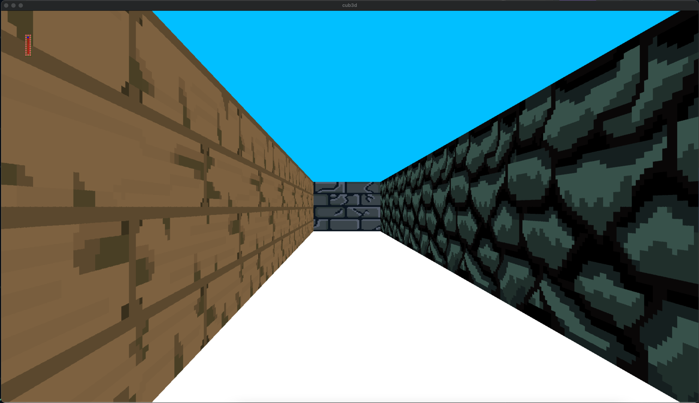

# cub3D
The goal of cub3d is to make something using raycasting.

* WASD to move, QE or Left/Right directional keys to rotate camera

* I to toggle Interface, O to toggle crosshair, L to toggle shadows

* ESC to quit

* Textures or colors for each sides (North, South, West, East) and Sky/Floor

